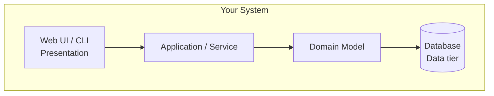
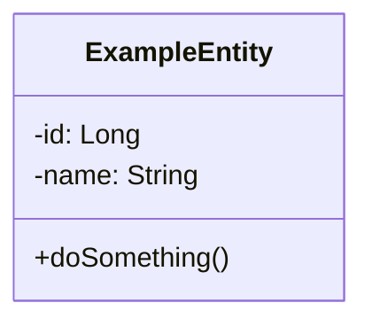
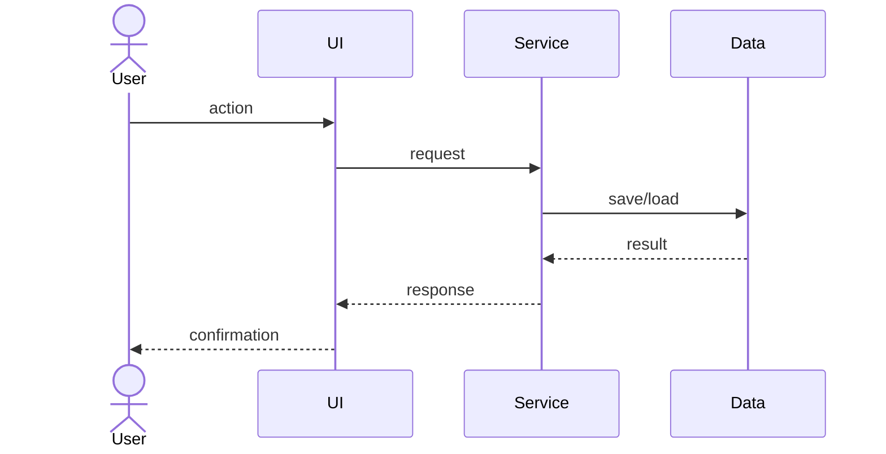

# HookIt

<!-- CI badge: after Session 4, replace ORG/REPO and the workflow filename, then uncomment:

-->

**Student:** Dionny Dinza · **Course:** CEN 5064 Software Design, Fall 2026 · **Partner:** [@lfriera92]

## Project (approval paragraph — write this by Sun Aug 30)

 HookIt is a native iOS application designed for recreational anglers to digitally log their catches while automatically ensuring compliance with local fishing regulations. To maintain a strict scope and clear architectural tiers, the system focuses on four core features: (1) an AI Fish Identification tool, the single permitted external API integration, that analyzes an uploaded photo to identify the species; (2) a Catch Logger where users record their harvest details (species, length, date); (3) a Static Regulations Database built directly into the app containing regional size limits and open seasons, eliminating the need for live weather or tide APIs; and (4) a Compliance Engine (Domain Rule) that automatically cross-references every logged catch against the static database to instantly warn the user if a fish is undersized or out of season.

## How to run

Prerequisites: This is a native iOS application. You must use a Mac with Xcode installed to compile and run this project.

   1) **Clone the repository:**
   ```bash
   git clone https://github.com/ddinza/cen5064-project-dinza.git
cd cen5064-project-dinza
   
2) Add the API Key (Required for AI Vision):

Obtain the secrets.plist file from the provided USB drive.

Drag and drop the secrets.plist file directly into the HookIt folder inside your newly cloned repository (it should sit in the same folder as the HookIt.xcodeproj file).

(Note: This file contains the private Gemini API key and is intentionally kept out of version control for security).

3) Build and Run:
Open HookIt.xcodeproj in Xcode.

Select an iPhone Simulator (e.g., iPhone 17 Pro Max) from the top destination menu.

Hit the Play/Run button (Cmd + R).

Note: When the app launches, be sure to grant Location permissions so the home screen UI can properly display the simulated fishing conditions.

```

## Architecture

### Tier breakdown (Session 2 studio)

| Tier | Responsibilities in THIS system |Example Classes/Modules|
|------|--------------------------------|----------------------------|
| Presentation | Displays the user interface, shows logged catches, collects input for new catches, and alerts the user of regulation violations. |HomeView, AddCatchView, IdentifyItView|
| Service | Orchestrates app workflows, such as handling a new catch photo and securely calling the AI vision integration for identification. |GeminiService|
| Domain | Defines core fishing entities and enforces the main business rule: validating whether a logged catch violates the static size or season limits for that specific species. |RegulationValidator, ComplianceStatus, FishSpecies|
| Data | Handles the local, on-device storage of user catch history as well as loading the static dataset of fishing regulations. |CatchManager, RegulationData|

### C4 — Context & Container (Session 3 studio)




### UML — Class & Sequence (Session 3 studio)





## Architecture Decision Records

Decisions live in [`docs/adr/`](docs/adr/). Start with ADR-001 in Session 4.

| # | Decision | Status |
|---|----------|--------|
| [001](docs/adr/adr-001.md) | [What I am building and why] | [proposed] |

## Weekly log (optional but recommended)

A one-line note per week keeps your commit story readable:

- Week 1 (Aug 24): repo created, HookIt core architecture and AI Vision integration drafted
- Week 2 (Aug 31): implemented local offline services, regulations data provider, and domain-tier validation rule
- Week 3 (Sep 7): finalized 4-feature scope constraint, integrated compliance engine alerts into catch logging, and resolved UI layout alignments
