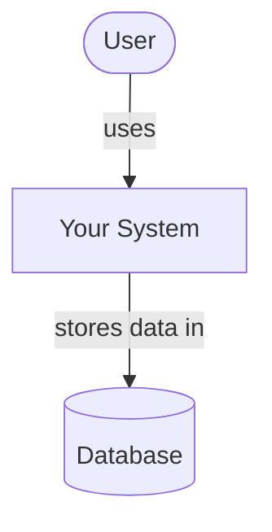
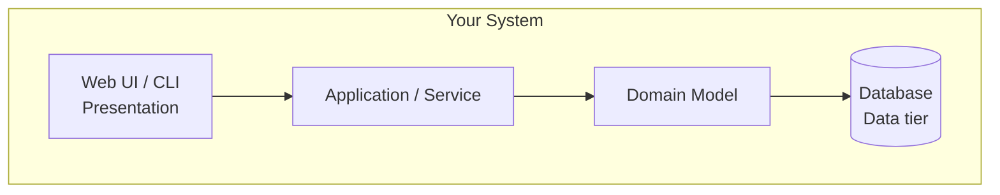
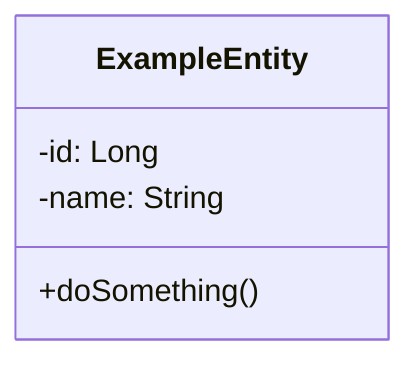
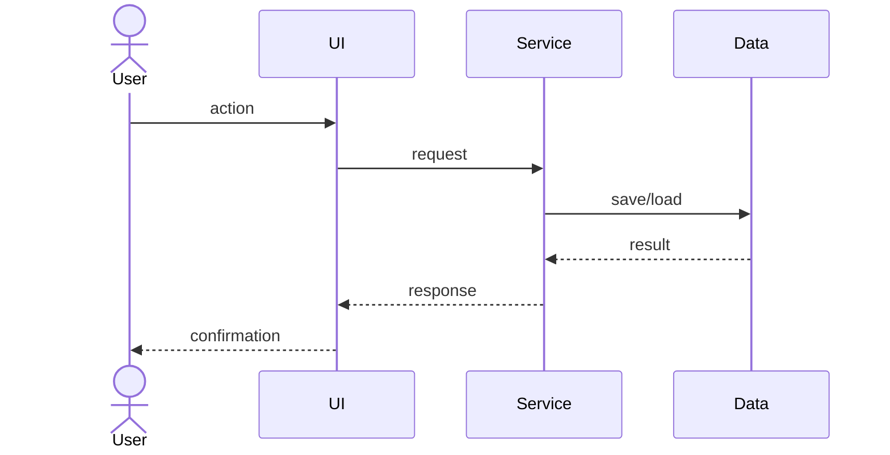

# HookIt

<!-- CI badge: after Session 4, replace ORG/REPO and the workflow filename, then uncomment:

-->

**Student:** Dionny Dinza · **Course:** CEN 5064 Software Design, Fall 2026 · **Partner:** [@lfriera92]

## Project (approval paragraph — write this by Sun Aug 30)

 HookIt is a web application designed for recreational anglers to track their catches while automatically ensuring compliance with local fishing regulations. The system focuses on four core features: (1) a Catch Logger where users digitally record their catches by species and length; (2) a Static Regulations Database built into the system containing regional size limits and open seasons; (3) a Compliance Engine that automatically cross-references a logged catch against the static database to warn the user if a fish is undersized or out of season; and (4) an AI Fish Identification tool utilizing the Gemini API to analyze an uploaded photo and identify the species before the user logs it.

## How to run

These instructions will run the web application locally. It is designed to work on both Windows and Mac environments.

   **Clone the repository:**
   ```bash
   git clone [https://github.com/ddinza/HookIt.git](https://github.com/ddinza/HookIt.git)
   cd HookIt
   
Create and activate a virtual environment:

Windows:

Bash
python -m venv venv
venv\Scripts\activate
Mac:

Bash
python3 -m venv venv
source venv/bin/activate
Install dependencies:

Bash
pip install -r requirements.txt
Add the API Key:
Create a .env file in the main folder.
(Note for my reviewer: I will message you the temporary GEMINI_API_KEY to paste into this file during review days).

Run the app:

Bash
python app.py
View it:
Open your browser to http://localhost:5000

```

## Architecture

### Tier breakdown (Session 2 studio)

| Tier | Responsibilities in THIS system |
|------|--------------------------------|
| Presentation | [what your UI layer does] |
| Service | [what your use-case/orchestration layer does] |
| Domain | [your entities and business rules] |
| Data | [how and where data is stored] |

### C4 — Context & Container (Session 3 studio)





### UML — Class & Sequence (Session 3 studio)





## Architecture Decision Records

Decisions live in [`docs/adr/`](docs/adr/). Start with ADR-001 in Session 4.

| # | Decision | Status |
|---|----------|--------|
| [001](docs/adr/adr-001.md) | [What I am building and why] | [proposed] |

## Weekly log (optional but recommended)

A one-line note per week keeps your commit story readable:

- Week 1 (Aug 24): repo created, three ideas drafted
- Week 2 (Aug 31): ...
